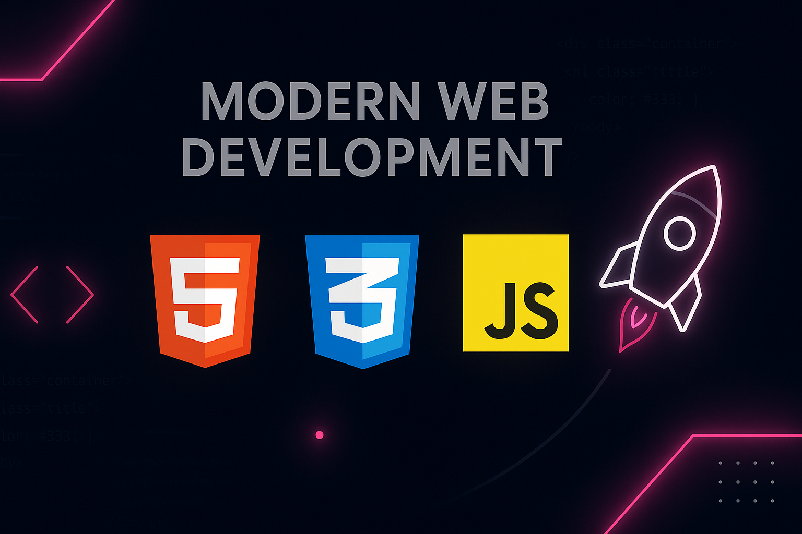
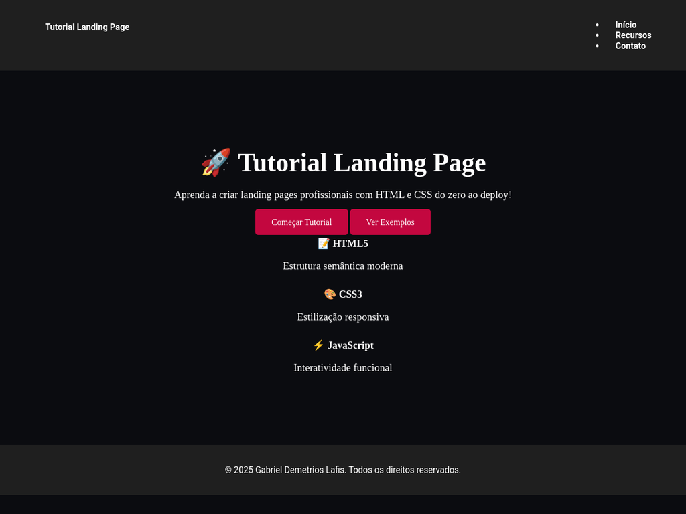
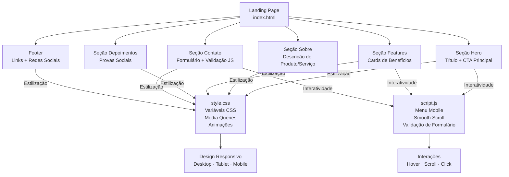
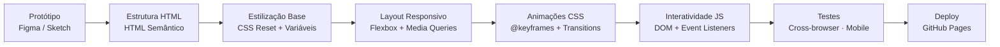
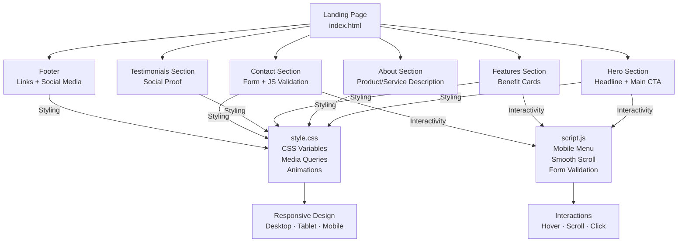
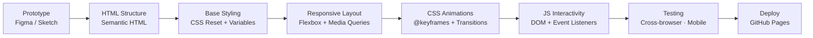

# 🚀 Tutorial Landing Page - HTML, CSS & JavaScript



<p align="center">
  
  
  
  
  
</p>

---

## 🇧🇷 Português

### Sobre o Projeto

Este repositório contém o código-fonte de uma landing page moderna e totalmente responsiva, criada como parte de um tutorial completo para ensinar os fundamentos do desenvolvimento web com **HTML5**, **CSS3** e **JavaScript**. O objetivo é fornecer um exemplo prático, profissional e funcional que sirva como um guia passo a passo para iniciantes e como um portfólio de referência para desenvolvedores.

### ✨ Live Demo

Visualize o projeto em ação! A landing page está hospedada e totalmente funcional através do GitHub Pages.

**[➡️ Acessar a Live Demo](https://galafis.github.io/-Criando-sua-Primeira-Landing-Page-com-HTML-e-CSS/)**

### 📸 Visualização do Projeto



### Principais Funcionalidades

- **Design Moderno e Responsivo:** Totalmente adaptável a desktops, tablets e smartphones.
- **Interatividade com JavaScript:** Menu de navegação mobile, smooth scrolling e animações dinâmicas.
- **Animações CSS:** Efeitos de hover, transições suaves e animações ao rolar a página.
- **Estrutura Semântica:** HTML5 organizado para melhor acessibilidade e SEO.
- **Formulário de Contato Funcional:** Com validação de campos em tempo real.
- **Código Otimizado:** Variáveis CSS, estrutura de arquivos organizada e melhores práticas de desenvolvimento.

### 🛠️ Tecnologias Utilizadas

| Tecnologia | Descrição |
| :---: | --- |
|  | Estrutura semântica e conteúdo da página. |
|  | Estilização, design responsivo e animações. |
|  | Interatividade, manipulação do DOM e funcionalidades dinâmicas. |

### 🏗️ Arquitetura do Projeto

O projeto segue uma estrutura de arquivos organizada para facilitar a manutenção e escalabilidade.



### 🚀 Como Começar

Para executar o projeto localmente, siga estes passos:

1.  **Clone o repositório:**
    ```bash
    git clone https://github.com/galafis/-Criando-sua-Primeira-Landing-Page-com-HTML-e-CSS.git
    ```
2.  **Navegue até o diretório do projeto:**
    ```bash
    cd -Criando-sua-Primeira-Landing-Page-com-HTML-e-CSS
    ```
3.  **Abra o arquivo `index.html` no seu navegador:**
    Você pode simplesmente arrastar o arquivo para a janela do navegador ou usar uma extensão como o Live Server no VS Code para uma melhor experiência de desenvolvimento.

### 🔄 Fluxo de Desenvolvimento

O desenvolvimento deste projeto seguiu um fluxo de trabalho claro e iterativo, desde a estruturação inicial até o deploy final.



### 🤝 Contribuindo

Contribuições são o que tornam a comunidade de código aberto um lugar incrível para aprender, inspirar e criar. Qualquer contribuição que você fizer será **muito apreciada**.

1.  Faça um Fork do projeto
2.  Crie sua Feature Branch (`git checkout -b feature/AmazingFeature`)
3.  Faça o Commit de suas mudanças (`git commit -m 'Add some AmazingFeature'`)
4.  Faça o Push para a Branch (`git push origin feature/AmazingFeature`)
5.  Abra um Pull Request

---

## 🇺🇸 English

### About The Project

This repository contains the source code for a modern and fully responsive landing page, created as part of a comprehensive tutorial to teach the fundamentals of web development with **HTML5**, **CSS3**, and **JavaScript**. The goal is to provide a practical, professional, and functional example that serves as a step-by-step guide for beginners and a reference portfolio for developers.

### ✨ Live Demo

See the project in action! The landing page is hosted and fully functional via GitHub Pages.

**[➡️ Access the Live Demo](https://galafis.github.io/-Criando-sua-Primeira-Landing-Page-com-HTML-e-CSS/)**

### 📸 Project Preview


### Key Features

- **Modern and Responsive Design:** Fully adaptable to desktops, tablets, and smartphones.
- **JavaScript Interactivity:** Mobile navigation menu, smooth scrolling, and dynamic animations.
- **CSS Animations:** Hover effects, smooth transitions, and scroll-triggered animations.
- **Semantic Structure:** Organized HTML5 for better accessibility and SEO.
- **Functional Contact Form:** With real-time field validation.
- **Optimized Code:** CSS variables, organized file structure, and development best practices.

### 🛠️ Technologies Used

| Technology | Description |
| :---: | --- |
|  | Semantic structure and page content. |
|  | Styling, responsive design, and animations. |
|  | Interactivity, DOM manipulation, and dynamic features. |

### 🏗️ Project Architecture

The project follows an organized file structure to facilitate maintenance and scalability.



### 🚀 Getting Started

To run the project locally, follow these steps:

1.  **Clone the repository:**
    ```bash
    git clone https://github.com/galafis/-Criando-sua-Primeira-Landing-Page-com-HTML-e-CSS.git
    ```
2.  **Navigate to the project directory:**
    ```bash
    cd -Criando-sua-Primeira-Landing-Page-com-HTML-e-CSS
    ```
3.  **Open the `index.html` file in your browser:**
    You can simply drag the file into the browser window or use an extension like Live Server in VS Code for a better development experience.

### 🔄 Development Workflow

The development of this project followed a clear and iterative workflow, from the initial structure to the final deployment.



### 🤝 Contributing

Contributions are what make the open source community such an amazing place to learn, inspire, and create. Any contributions you make are **greatly appreciated**.

1.  Fork the Project
2.  Create your Feature Branch (`git checkout -b feature/AmazingFeature`)
3.  Commit your Changes (`git commit -m 'Add some AmazingFeature'`)
4.  Push to the Branch (`git push origin feature/AmazingFeature`)
5.  Open a Pull Request

---

### 📜 License

Distribuído sob a licença MIT. Veja `LICENSE` para mais informações.

Distributed under the MIT License. See `LICENSE` for more information.

---

### 👨‍💻 Authorship

Este projeto foi criado por **Gabriel Demetrios Lafis**.

This project was created by **Gabriel Demetrios Lafis**.

